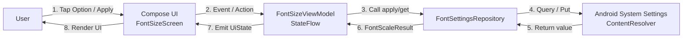
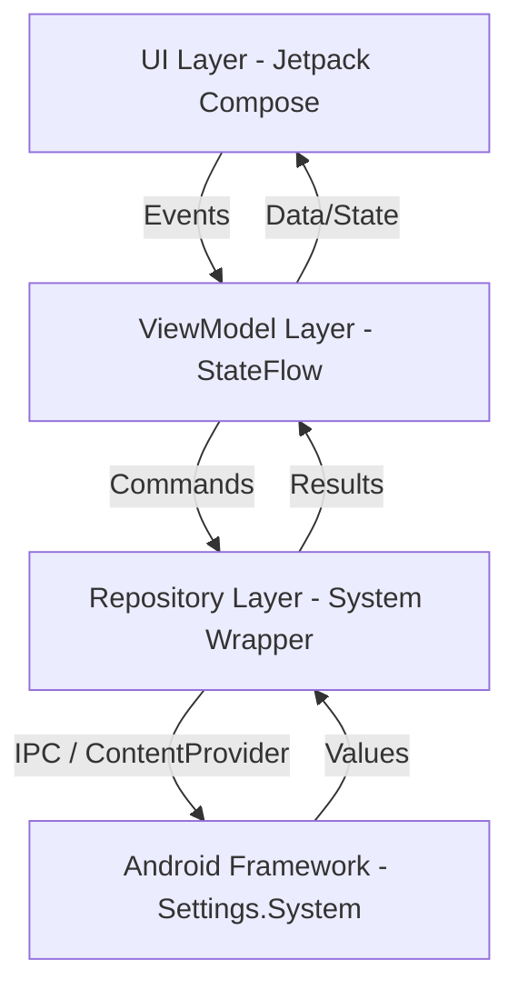

# Architecture Design & Package Structure — Project 1: Font Size App

> **Tài liệu Thiết kế Kiến trúc (Architecture Specifications)**  
> **Phiên bản:** 1.0  
> **Mô hình kiến trúc:** MVVM (Model - View - ViewModel) + Repository Pattern trong Jetpack Compose  

---

## 1. Architectural Overview

Ứng dụng **Font Size App** được thiết kế theo nguyên tắc kiến trúc khuyến nghị của Android (Android Architecture Guidelines):
1. **Separation of Concerns:** Tách biệt triệt để giao diện người dùng (UI), logic điều phối trạng thái (ViewModel) và tầng truy cập hệ thống (Repository).
2. **Drive UI from Data Models:** Giao diện là hàm phản ánh của trạng thái (`UI = f(State)`). Mọi thay đổi đều bắt nguồn từ một nguồn dữ liệu duy nhất (`FontSizeUiState`).
3. **Single Source of Truth:** `FontSettingsRepository` quản lý việc đọc/ghi cấu hình font hệ điều hành (`Settings.System.FONT_SCALE`), đóng vai trò cung cấp dữ liệu tin cậy cho ứng dụng.

---

## 2. Package Structure

```
com.example.fontsizecontroller/
├── MainActivity.kt                  # Activity khởi chạy Compose UI và tích hợp Edge-to-Edge
├── model/
│   ├── FontSizeOption.kt            # Model đại diện cho một tùy chọn font (label, scale)
│   ├── FontSizeData.kt              # Preset mặc định và danh sách lựa chọn khởi tạo
│   ├── FontScaleResult.kt           # Sealed class mô tả kết quả thao tác (Success, Permission, Error...)
│   └── FontSizeUiState.kt           # State hoàn chỉnh của màn hình & Enum FontSizeStatus
├── repository/
│   └── FontSettingsRepository.kt     # Interface contract giao tiếp với Android System Settings
├── viewmodel/
│   └── FontSizeViewModel.kt          # ViewModel điều phối StateFlow và tiếp nhận action từ UI
├── ui/
│   ├── screen/
│   │   ├── FontSizeScreen.kt        # Màn hình chính quản lý cỡ chữ
│   │   └── PocScreen.kt             # Màn hình POC dùng cho kiểm thử thực nghiệm
│   ├── component/
│   │   ├── FontPresetCard.kt        # Card lựa chọn từng nấc cỡ chữ
│   │   ├── FontPreviewCard.kt       # Card xem trước kích thước chữ cục bộ
│   │   └── StatusMessage.kt         # Card hiển thị trạng thái kết quả
│   └── theme/
│       ├── Color.kt
│       ├── Theme.kt
│       └── Type.kt
└── util/
    └── FontScaleMapper.kt           # Tiện ích ánh xạ giữa Float scale hệ thống và FontSizeOption
```

---

## 3. Layer Rules & Boundaries

| Tầng (Layer) | Được phép làm | Tuyệt đối KHÔNG NÊN làm |
|---|---|---|
| **UI (Compose)** | - Render giao diện dựa trên State truyền vào.<br>- Gửi user event/action lên ViewModel.<br>- Áp dụng Typography, Animation và layout. | - **KHÔNG** gọi `Settings.System.getFloat()` hay `putFloat()` trực tiếp.<br>- **KHÔNG** tự ý kiểm tra `Settings.System.canWrite()`.<br>- **KHÔNG** chứa business logic tính toán hay mapping scale. |
| **ViewModel** | - Quản lý `MutableStateFlow` nội bộ và public `StateFlow`.<br>- Điều phối Coroutine (`viewModelScope.launch`).<br>- Gọi Repository để lấy hoặc thay đổi dữ liệu. | - **KHÔNG** giữ reference tới `Activity`, `Context` hoặc Compose View.<br>- **KHÔNG** import các package `androidx.compose.material3.*` trong ViewModel. |
| **Repository** | - Tương tác với `ContentResolver`, `Settings.System`, `Configuration`.<br>- Bọc các ngoại lệ hệ thống (`SecurityException`, `SettingNotFoundException`).<br>- Trả về Domain Result rõ ràng (`FontScaleResult`). | - **KHÔNG** can thiệp vào UI logic hay điều hướng màn hình.<br>- **KHÔNG** giữ UI State của Compose. |
| **Model / Util** | - Định nghĩa Data class, Enum, Sealed interface thuần Kotlin.<br>- Thực hiện các phép toán thuần túy (Math, so sánh float dung sai 0.03f). | - **KHÔNG** phụ thuộc vào Lifecycle hay Android UI Components. |

---

## 4. Data Flow Diagram



---

## 5. State Management Design

### 5.1. Immutable UiState
```kotlin
data class FontSizeUiState(
    val isLoading: Boolean = true,
    val currentScale: Float? = null,
    val selectedOption: FontSizeOption? = null,
    val canWriteSettings: Boolean = false,
    val isApplying: Boolean = false,
    val status: FontSizeStatus = FontSizeStatus.Idle,
    val message: String? = null
)

enum class FontSizeStatus {
    Idle,
    PermissionRequired,
    Success,
    Error,
    Unsupported
}
```

### 5.2. Reactive StateFlow trong ViewModel
```kotlin
private val _uiState = MutableStateFlow(FontSizeUiState())
val uiState: StateFlow<FontSizeUiState> = _uiState.asStateFlow()
```

---

## 6. Architecture Overview Diagram


