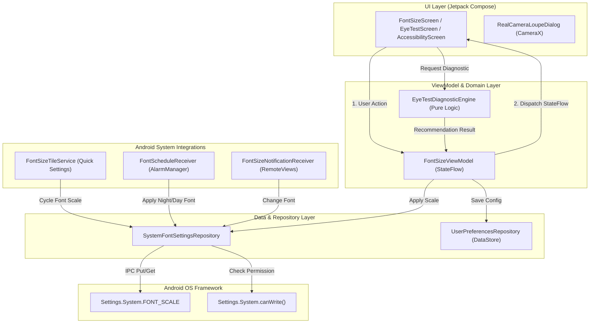

# Architecture Design & Package Structure — FontM (v1.0.0 Release)

> **Tài liệu Thiết kế Kiến trúc (Architecture Specifications)**  
> **Phiên bản:** 1.0.0 Official Release  
> **Mô hình kiến trúc:** Clean Architecture + MVVM (Model - View - ViewModel) + Repository Pattern trong Jetpack Compose  

---

## 1. Architectural Overview

Ứng dụng **FontM (Font Size Controller)** tuân thủ triệt để nguyên tắc **Clean Architecture** kết hợp nguyên lý luồng dữ liệu một chiều (**Unidirectional Data Flow - UDF**) và chuẩn thiết kế Android khuyến nghị:
1. **Separation of Concerns:** Tách biệt triệt để giao diện người dùng (UI Layer), logic nghiệp vụ & chẩn đoán thuần túy (Domain Layer), điều phối luồng trạng thái (ViewModel Layer), lưu trữ & truy cập hệ điều hành (Repository Layer), và các dịch vụ nền (Service / Receiver Layer).
2. **Drive UI from Reactive State:** Giao diện là hàm phản ánh của trạng thái (`UI = f(State)`). Mọi thay đổi đều được phát xuất từ một nguồn duy nhất bất biến (`FontSizeUiState` qua Kotlin `StateFlow`).
3. **Single Source of Truth:** `SystemFontSettingsRepository` quản lý việc đọc/ghi cấu hình font hệ điều hành (`Settings.System.FONT_SCALE`), kết hợp `UserPreferencesRepository` (Jetpack DataStore) lưu trữ cấu hình người dùng bất đồng bộ.
4. **Pure Domain Logic:** Động cơ chẩn đoán thị lực (`EyeTestDiagnosticEngine`) hoàn toàn không phụ thuộc vào Android SDK hay Compose UI, cho phép kiểm thử tự động 100% với JUnit độc lập.

---

## 2. Package Structure (Cấu trúc mã nguồn chính thức v1.0.0)

```
com.example.fontsizecontroller/
├── MainActivity.kt                      # Activity khởi chạy Compose UI, Edge-to-Edge và Navigation
│
├── domain/                              # Pure Kotlin Domain Layer (Không phụ thuộc Android SDK)
│   └── EyeTestDiagnosticEngine.kt       # Thuật toán phân tích thị lực 3 bước & gợi ý cỡ chữ tối ưu
│
├── model/                               # Data Models, Enums & Sealed States
│   ├── AppLanguage.kt                   # Hỗ trợ song ngữ (VI, EN)
│   ├── FamilyProfile.kt                 # Cấu hình hồ sơ gia đình (Cá nhân, Bố mẹ, Ông bà)
│   ├── FontScaleApplyResult.kt          # Sealed class kết quả ghi hệ thống (Success, PermissionDenied...)
│   ├── FontSizeData.kt                  # Dữ liệu preset ban đầu
│   ├── FontSizeOption.kt                # Model đại diện cho một tùy chọn font (label, scale)
│   ├── FontSizeUiState.kt               # StateFlow state toàn diện (Theme, Language, Scale, Camera...)
│   ├── ReadingMode.kt                   # Chế độ màu bảo vệ mắt (Standard, Sepia, High Contrast)
│   └── ScreenDestination.kt             # Sealed class điều hướng màn hình
│
├── repository/                          # Data Access Layer & Android Wrappers
│   ├── SystemFontSettingsRepository.kt   # Interface contract giao tiếp với System Settings
│   ├── SystemFontSettingsRepositoryImpl.kt # Thực thi đọc/ghi Settings.System và verify
│   ├── UserPreferencesRepository.kt     # Interface lưu trữ preferences
│   └── UserPreferencesRepositoryImpl.kt # Thực thi Jetpack DataStore Preferences
│
├── service/                             # Android System Services & Broadcast Receivers
│   ├── FontScheduleReceiver.kt          # BroadcastReceiver thực hiện hẹn giờ phóng to font ban đêm
│   ├── FontSizeNotificationReceiver.kt  # BroadcastReceiver xử lý click trên RemoteViews thông báo
│   ├── FontSizeTileService.kt           # Android Quick Settings Tile (Phím tắt 1 chạm trên thanh trạng thái)
│   └── QuickControlNotificationManager.kt # Quản lý hiển thị RemoteViews trên khay thông báo
│
├── viewmodel/                           # State Holders & User Interaction Orchestration
│   └── FontSizeViewModel.kt             # ViewModel điều phối StateFlow, Coroutines và User Actions
│
├── ui/
│   ├── component/                       # Reusable Compose Components
│   │   ├── AppBottomNavigationBar.kt    # Thanh điều hướng 3 Tab chuẩn Material 3
│   │   ├── CameraLoupeSection.kt        # Card giới thiệu & kích hoạt kính lúp
│   │   ├── FontPresetCard.kt            # Thẻ chọn từng mốc cỡ chữ
│   │   ├── FontPreviewCard.kt           # Thẻ xem trước trực tiếp theo đơn vị sp
│   │   ├── NightScheduleCard.kt         # Card cấu hình hẹn giờ ban đêm
│   │   ├── OemDiagnosticsCard.kt        # Card chẩn đoán và hướng dẫn tối ưu pin theo hãng máy
│   │   ├── RealCameraLoupeDialog.kt     # Kính lúp camera thật tích hợp CameraX, zoom 1x-5x, flash, pause
│   │   ├── StatusMessage.kt             # Thẻ thông báo kết quả thao tác
│   │   └── TopAppBarWithLanguage.kt     # Thanh tiêu đề tích hợp nút chuyển đổi VI/EN và Dark Mode
│   │
│   ├── screen/                          # Application Screens
│   │   ├── AccessibilityScreen.kt       # Tab Trợ Năng (Chữ đậm, tương phản cao, hẹn giờ, kính lúp)
│   │   ├── EyeTestScreen.kt             # Tab Đo Mắt (Quy trình 3 bước cố định cỡ 1.00x chuẩn)
│   │   ├── FontGalleryScreen.kt         # Màn hình chọn kiểu phông chữ nội bộ ứng dụng
│   │   ├── FontSizeScreen.kt            # Tab Cỡ Chữ (Màn hình chính điều chỉnh font scale hệ thống)
│   │   ├── OnboardingScreen.kt          # Màn hình chào mừng người dùng mới
│   │   ├── PermissionScreen.kt          # Màn hình hướng dẫn cấp quyền WRITE_SETTINGS
│   │   ├── ResultScreen.kt              # Màn hình thông báo kết quả sau khi áp dụng
│   │   ├── SettingsAndHelpScreen.kt     # Màn hình Cài đặt & Hướng dẫn theo hãng máy
│   │   └── UnsupportedErrorScreen.kt    # Màn hình xử lý lỗi thiết bị không hỗ trợ
│   │
│   └── theme/                           # Color, Theme, Typography & Dynamic Fonts
│       ├── Color.kt
│       ├── Theme.kt
│       └── Type.kt
│
└── util/                                # Pure Utility Classes & Helpers
    ├── FontScaleMapper.kt               # Ánh xạ Float scale sang FontSizeOption (dung sai 0.03f)
    ├── FontScheduleManager.kt           # Cài đặt báo thức AlarmManager cho lịch hẹn ban đêm
    └── OemCompatibilityHelper.kt        # Nhận diện OEM (Samsung, Xiaomi, Oppo) & quản lý pin ngầm
```

---

## 3. Layer Rules & Boundaries (Quy Tắc Phân Tầng)

| Tầng (Layer) | Được phép làm | Tuyệt đối KHÔNG ĐƯỢC làm |
|---|---|---|
| **UI (Compose)** | - Render giao diện dựa trên `FontSizeUiState`.<br>- Gửi user event/action lên ViewModel.<br>- Quản lý animation cục bộ và layout. | - **KHÔNG** gọi `Settings.System.getFloat()` hay `putFloat()` trực tiếp.<br>- **KHÔNG** tự ý kiểm tra `Settings.System.canWrite()`.<br>- **KHÔNG** chứa logic tính toán đo mắt hay lưu DataStore. |
| **ViewModel** | - Quản lý `MutableStateFlow` nội bộ và expose `StateFlow` bất biến.<br>- Điều phối Coroutine (`viewModelScope.launch` với `Dispatchers.IO`).<br>- Gọi Repository và Domain Engine. | - **KHÔNG** giữ reference tới `Activity` hoặc Compose View tránh rò rỉ RAM.<br>- **KHÔNG** import các package Compose UI trong ViewModel. |
| **Domain** | - Thực hiện thuật toán chẩn đoán thị lực, phân tích phản hồi.<br>- Pure Kotlin, không phụ thuộc Android Framework. | - **KHÔNG** phụ thuộc vào Context, View, hay Compose runtime. |
| **Repository** | - Tương tác với `ContentResolver`, `Settings.System`, `Configuration`, `DataStore`.<br>- Bọc các ngoại lệ hệ thống (`SecurityException`, `SettingNotFoundException`).<br>- Trả về Domain Result rõ ràng (`FontScaleResult`). | - **KHÔNG** can thiệp vào UI logic hay điều hướng màn hình. |
| **Services / Receivers** | - Nhận Intent từ hệ thống (Boot completed, AlarmManager, RemoteViews click, Tile click).<br>- Tương tác với Repository để thay đổi font hoặc cập nhật UI Notification. | - **KHÔNG** thực hiện các tác vụ nặng đồng bộ trên Main Thread. |

---

## 4. End-to-End Data Flow Diagram


```mermaid
flowchart TD
    subgraph UI_Layer["UI Layer (Jetpack Compose)"]
        UI_Screen["FontSizeScreen / EyeTestScreen / AccessibilityScreen"]
        UI_Dialog["RealCameraLoupeDialog (CameraX)"]
    end

    subgraph VM_Layer["ViewModel & Domain Layer"]
        VM["FontSizeViewModel (StateFlow<FontSizeUiState>)"]
        DOMAIN["EyeTestDiagnosticEngine (Pure Logic)"]
    end

    subgraph Service_Layer["Android System Integrations"]
        TILE["FontSizeTileService (Quick Settings)"]
        ALARM["FontScheduleReceiver (AlarmManager)"]
        NOTIF["FontSizeNotificationReceiver (RemoteViews)"]
    end

    subgraph Data_Layer["Data & Repository Layer"]
        REPO_SYS["SystemFontSettingsRepository"]
        REPO_PREF["UserPreferencesRepository (DataStore)"]
    end

    subgraph OS_Layer["Android OS Framework"]
        SYS_SETTINGS["Settings.System.FONT_SCALE"]
        SYS_PERM["Settings.System.canWrite()"]
    end

    UI_Screen -->|1. User Action| VM
    UI_Screen -->|Request Diagnostic| DOMAIN
    DOMAIN -->|Recommendation Result| VM
    VM -->|2. Dispatch StateFlow| UI_Screen

    VM -->|Apply Scale| REPO_SYS
    VM -->|Save Config| REPO_PREF
    TILE -->|Cycle Font Scale| REPO_SYS
    ALARM -->|Apply Night/Day Font| REPO_SYS
    NOTIF -->|Change Font| REPO_SYS

    REPO_SYS -->|IPC Put/Get| SYS_SETTINGS
    REPO_SYS -->|Check Permission| SYS_PERM
```

---

## 5. Chiến Lược Kiểm Thử Tự Động (Testing Strategy)

Ứng dụng được thiết kế theo chuẩn Test-Driven Development (TDD) với độ phủ kiểm thử cao:
1. **Domain Unit Tests (`EyeTestDiagnosticEngineTest`):** 6 tests kiểm tra logic trắc nghiệm thị lực 3 bước và gợi ý cỡ chữ tối ưu cho từng mức độ thị lực.
2. **ViewModel Unit Tests (`FontSizeViewModelTest`):** 10 tests kiểm tra luồng dữ liệu StateFlow, chuyển đổi ngôn ngữ, hồ sơ gia đình và xử lý ngoại lệ.
3. **Repository & Manager Tests:** 12 tests cho `FontScaleMapperTest`, 3 tests cho `FontScheduleManagerTest`, 2 tests cho `OemCompatibilityHelperTest`.
4. **Tổng số Unit Tests:** 36/36 tests đạt tỷ lệ **100% PASS** trên JVM độc lập.
