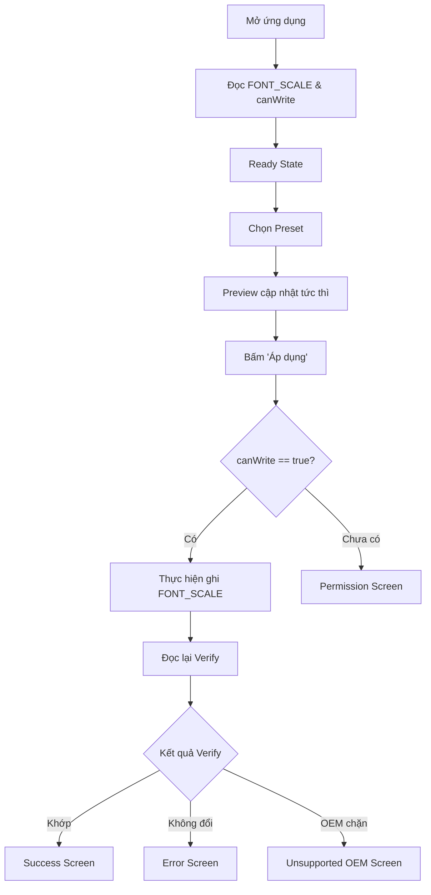

# UI Design & User Flow Specifications — Project 1: Font Size App

> **Tài liệu Thiết kế Giao diện & Luồng tương tác (UI/UX Specifications)**  
> **Giai đoạn:** Tuần 2 - Ngày 3  
> **Design Standard:** Material Design 3 (Material You) + Accessibility WCAG 2.1 AA  

---

## 1. Figma Project Link

- **Figma Design URL:** [Font Size Controller Figma Prototype](https://www.figma.com/design/SIXUIUjDzjYbuPCUjHVOXM/FontSizeAppDesign?node-id=0-1&p=f&t=uBkQlDMUGb0OePXK-0)
- **Thiết bị chuẩn:** Google Pixel / Samsung Galaxy (Material 3 Adaptive Design)
- **Quy mô thiết kế:** 10 màn hình hoàn chỉnh (Onboarding, Main, Permission, Success, Error/Unsupported, Font 200%, Font Styles, Eye-test, Accessibility Suite, English Version) kèm luồng tương tác Prototype.

## 2. User Flow & Permission Flow

### 1.1. User Flow


### 1.2. Permission Flow
```mermaid
flowchart TD
    A[Nhấn nút 'Áp dụng'] --> B{canWrite == true?}
    B -->|true| C[Ghi cài đặt hệ thống]
    B -->|false| D[Giải thích quyền WRITE_SETTINGS]
    D --> E[Mở ACTION_MANAGE_WRITE_SETTINGS]
    E --> F[User cấp quyền & quay lại]
    F --> G[onResume: Re-check canWrite()]
    G --> B
```

---

## 2. Danh mục màn hình thiết kế (Screen Inventory)

1. **Main Font Controller Screen:**
   - App bar với tiêu đề và Accessibility Action.
   - Current Font Size badge (hiển thị scale thực tế và nhãn preset).
   - 4 Font Presets Card: Small (0.85x), Normal (1.00x), Large (1.15x), Extra Large (1.30x).
   - Live Interactive Preview Card: Văn bản mẫu tự động thay đổi kích cỡ theo preset đang chọn.
   - Nút hành động nổi bật "Áp dụng cỡ chữ".
   - Switch "Chữ đậm toàn hệ thống" *(Mở rộng)*.

2. **Permission Explanation Dialog / Screen:**
   - Biểu tượng bảo mật và minh họa công tắc Android.
   - Giải thích rõ ràng vì sao cần quyền thay đổi cài đặt hệ thống.
   - Nút hành động dẫn trực tiếp vào `Settings.ACTION_MANAGE_WRITE_SETTINGS`.
   - Nút bỏ qua / chỉ dùng thử trong ứng dụng.

3. **Result States:**
   - **Success Screen:** Biểu tượng tích xanh, xác nhận scale mới và gợi ý kiểm tra trên các app khác ngoài máy.
   - **Error Screen:** Thông báo lỗi ghi và nút thử lại.
   - **Unsupported OEM Screen:** Hướng dẫn mở Cài đặt màn hình của nhà sản xuất (Xiaomi, Samsung) khi ghi ngầm bị chặn.

4. **Stress-test Screen ở 200% Font Scale:**
   - Giao diện không bị vỡ layout (no clipping).
   - Text wrap tự nhiên, nút bấm co giãn tối thiểu 48dp–56dp, màn hình cuộn mượt mà.

---

## 3. UI States Architecture

```kotlin
sealed interface ScreenState {
    data object Loading : ScreenState
    data object PermissionRequired : ScreenState
    data object Ready : ScreenState
    data object Applying : ScreenState
    data object Success : ScreenState
    data class Error(val message: String) : ScreenState
    data object Unsupported : ScreenState
}
```

---

## 4. Compose Components Structure

- `FontSizeScreen.kt`: Container điều phối chính
- `FontPresetCard.kt`: Thẻ chọn từng mức font
- `FontPreviewCard.kt`: Khung xem trước trực quan
- `StatusMessage.kt`: Phản hồi trạng thái
- `PermissionDialog.kt`: Hộp thoại yêu cầu quyền hệ thống
- `PocScreen.kt`: Màn hình kiểm nghiệm thực địa
